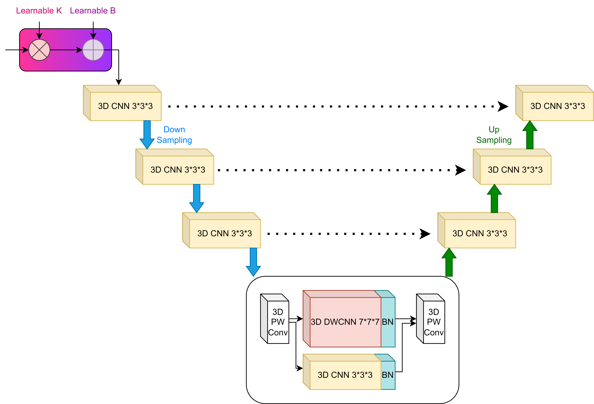

# SALKUnet

**S**UV **A**dapter **L**arge **K**ernel **U-Net** (**SALKUnet**) is a Unet based model which composed of a large kernel convolution and an SUV adapter for  [Ultra-Low Dose PET Imaging Challenge 2024]([Ultra-Low Dose PET Imaging Challenge 2024 | UDPET Challenge 2024 (udpet-challenge-2024.github.io)](https://udpet-challenge-2024.github.io/))  to reconstruct full-dose PET from low-dose PET include DRF100, 50, 20, 10 and 4.



# Results

This table summarizes our reconstruction results for SALKUnet :
For train and evaluate
|          | DRF100 | DRF50 | DRF20 | DRF10 | DRF4  |
| -------- | ------ | ----- | ----- | ----- | ----- |
| PSNR(dB) | 32.19  | 35.00 | 35.66 | 37.38 | 34.63 |

# Training and evaluate models

You can run to train and evaluate model:

For train and evaluate DRF100:

```
python main.py --configs_name="./configs/SALKUnetConfig_D100.py" --workdir="your training path"

python main.py --configs_name="./configs/SALKUnetConfig_D100_eval.py" --eval_dir="your evaluate path" --eval_path="your ckpt"
```

For train and evaluate DRF50:

```
python main.py --configs_name="./configs/SALKUnetConfig_D50.py" --workdir="your training path"

python main.py --configs_name="./configs/SALKUnetConfig_D50_eval.py" --eval_dir="your evaluate path" --eval_path="your ckpt"
```

For train and evaluate DRF20:

```
python main.py --configs_name="./configs/SALKUnetConfig_D20.py" --workdir="your training path"

python main.py --configs_name="./configs/SALKUnetConfig_D20_eval.py" --eval_dir="your evaluate path" --eval_path="your ckpt"
```

For train and evaluate DRF10:

```
python main.py --configs_name="./configs/SALKUnetConfig_D10.py" --workdir="your training path"

python main.py --configs_name="./configs/SALKUnetConfig_D10_eval.py" --eval_dir="your evaluate path" --eval_path="your ckpt"
```

For train and evaluate DRF4:

```
python main.py --configs_name="./configs/SALKUnetConfig_D4.py" --workdir="your training path"

python main.py --configs_name="./configs/SALKUnetConfig_D4_eval.py" --eval_dir="your evaluate path" --eval_path="your ckpt"
```

